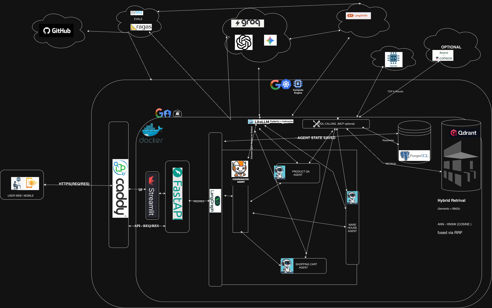
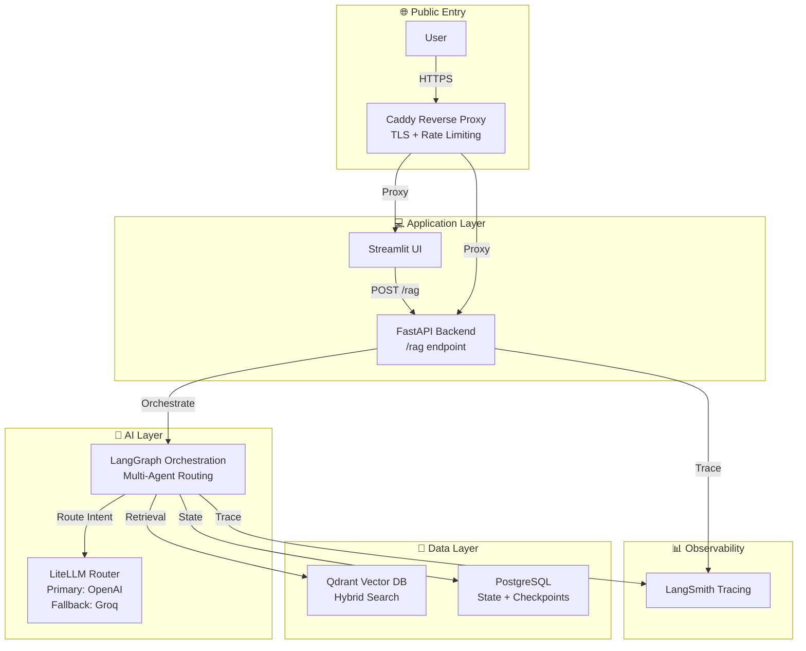
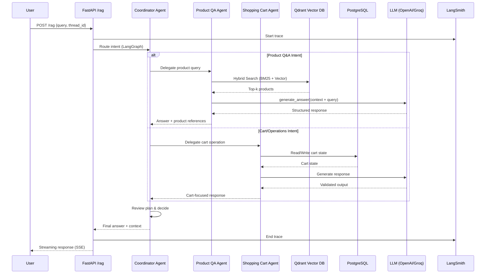

# Multi-Agent Product Intelligence Platform
** ⚠️The full production implementation is maintained in an another private repository.**

This public repository provides architecture, contracts, and a mock-mode demo to demonstrate engineering depth without exposing proprietary code.


> **Production-grade multi-agent system** demonstrating the evolution from Hybrid RAG to Agentic RAG and Multi-Agent orchestration for e-commerce product intelligence.

[](LICENSE)
[Architecture](docs/architecture.md)

## 🎯 60-Second Overview

This platform processes complex user queries through **intelligent multi-agent orchestration**, delivering accurate, context-aware responses while managing multi-step workflows (product Q&A, shopping cart operations, warehouse reservations).

**Core Flow**: User Query → FastAPI → Coordinator Agent (LangGraph) → Specialized Agents → Tools (Vector DB/PostgreSQL) → LLM (with fallbacks) → Structured Response

**Key Highlights:**
- ✅ **Multi-Agent Orchestration**: Coordinator-based routing to 3 specialized agents (Product QA, Shopping Cart, Warehouse Manager)
- ✅ **Hybrid Search**: Semantic + keyword search (BM25) with Reciprocal Rank Fusion
- ✅ **Production Metrics**: 0% error rate, <2s P50 latency, deployed on GCP
- ✅ **Full Observability**: End-to-end tracing with LangSmith
- ✅ **Structured Outputs**: Type-safe LLM responses with Instructor + Pydantic

## 🏛️ System Architecture

### High-Level Architecture Diagram



*Complete system architecture showing all layers from user interface through orchestration, agents, data stores, and external services (LLM providers, observability, CI/CD).*

### Architecture Flow Diagram



**Detailed Architecture**: See [docs/architecture.md](docs/architecture.md)

## 🔄 Request Lifecycle



**Detailed Flows**: See [docs/flow.md](docs/flow.md)

## 🎬 Four Core Agent Flows

The system uses four specialized agents orchestrated by a coordinator:

### 1. Coordinator Agent Flow

**Purpose**: Intent analysis and intelligent routing to specialist agents

**Flow**:
1. Receives user query and conversation history
2. Analyzes intent using LLM (OpenAI GPT-4.1)
3. Creates execution plan
4. Routes to appropriate specialist agent (Product QA, Shopping Cart, or Warehouse Manager)
5. Reviews results and decides next steps
6. Can route to multiple agents sequentially for complex queries
7. Finalizes response when plan is complete

**Result**: Intelligent orchestration ensuring queries reach the right specialist agent.

### 2. Product QA Agent Flow

**User Query**: "What kind of earphones can I get?"

**Flow**:
1. Coordinator Agent analyzes intent → routes to Product QA Agent
2. Product QA Agent embeds query → performs hybrid search in Qdrant
3. Retrieves top-k products (semantic + keyword matching)
4. Formats context → calls LLM with structured output schema
5. Returns answer with product references and citations

**Result**: Contextual product recommendations with references to specific items.

### 3. Shopping Cart Agent Flow

**User Query**: "Add the most durable iPhone charger to my cart"

**Flow**:
1. Coordinator Agent routes to Product QA Agent (find product)
2. Product QA Agent retrieves products, analyzes reviews for durability
3. Coordinator routes to Shopping Cart Agent (add to cart)
4. Shopping Cart Agent writes to PostgreSQL (persistent cart state)
5. Returns confirmation with cart summary

**Result**: Multi-step workflow completed with persistent state management.

### 4. Warehouse Manager Agent Flow

**User Query**: "Check availability and reserve these items in your warehouse"

**Flow**:
1. Coordinator Agent routes to Warehouse Manager Agent
2. Warehouse Manager Agent checks inventory in PostgreSQL
3. Verifies item availability across warehouse locations
4. Creates reservations for available items
5. Returns reservation confirmation with warehouse details

**Result**: Inventory management and warehouse reservations with persistent state.

**Multi-Agent Coordination**: Complex queries can involve multiple agents working together. For example, a query like "Find durable products, add to cart, and reserve in warehouse" would flow through: Coordinator → Product QA → Shopping Cart → Warehouse Manager → Coordinator (finalize).

**Detailed Steps**: See [docs/flow.md](docs/flow.md) for numbered step-by-step flows for all agents.

## 📊 Observability

**Full End-to-End Tracing** with LangSmith:
- ✅ All agent executions (coordinator, product QA, shopping cart, warehouse)
- ✅ Tool calls (retrieval, cart operations, warehouse checks)
- ✅ LLM API calls (OpenAI, Groq fallback)
- ✅ Embedding generation
- ✅ Vector database queries
- ✅ User feedback integration

**Metrics Tracked**:
- Latency (P50, P99)
- Error rates
- Token usage and costs
- Routing accuracy
- Retrieval quality

**Production Metrics** (7-day monitoring):
- **Reliability**: 0% error rate
- **Performance**: P50 latency ~1.2-1.3s, P99 ~1.5-1.6s
- **Cost Efficiency**: ~$0.01-0.05 per trace (P50)

**Detailed Observability**: See [docs/observability.md](docs/observability.md)

## 🛠️ Tech Stack

| Category | Technology | Purpose |
|----------|-----------|---------|
| **Backend** | FastAPI | REST API with async support, streaming |
| **Orchestration** | LangGraph | Multi-agent workflow orchestration |
| **LLM Routing** | LiteLLM | Unified API with OpenAI (primary), Groq (fallback) |
| **Structured Outputs** | Instructor + Pydantic | Type-safe LLM responses |
| **Vector DB** | Qdrant | Hybrid search (semantic + BM25) |
| **Relational DB** | PostgreSQL | State persistence, checkpoints, cart data |
| **Observability** | LangSmith | Experiment tracking, tracing, evaluation |
| **Frontend** | Streamlit | Interactive chat UI |
| **Infrastructure** | Docker Compose, Caddy, GCP | Containerized deployment with TLS |

## 📡 API Endpoints

**Base URL**: `https://api.surendiran.ai` (production) or `http://localhost:8000` (local)

### `POST /rag`
Main RAG endpoint for agent queries (streaming response).

**Request**:
```json
{
  "query": "What kind of earphones can I get?",
  "thread_id": "user-123-session-456"
}
```

**Response**: Server-Sent Events (SSE) stream with structured JSON:
```json
{
  "request_id": "req-abc123",
  "answer": "Based on your query, here are some excellent earphone options...",
  "used_context": [
    {
      "image_url": "https://example.com/product.jpg",
      "price": 29.99,
      "description": "Wireless Bluetooth Earbuds..."
    }
  ]
}
```

### `POST /submit_feedback`
Submit user feedback for agent responses.

**Request**:
```json
{
  "feedback_score": 1,
  "feedback_text": "Great recommendations!",
  "trace_id": "trace-xyz789",
  "thread_id": "user-123-session-456",
  "feedback_source_type": "Human"
}
```

**Response**:
```json
{
  "request_id": "req-def456",
  "status": "success"
}
```

**Full API Specification**: See [contracts/openapi.yaml](contracts/openapi.yaml)

**Sample Requests/Responses**: See [samples/](samples/)

## 🚀 Live Demo

**Try the platform live:**
- **🎨 Chat Interface**: [https://demo.surendiran.ai](https://demo.surendiran.ai) - Interactive multi-agent e-commerce assistant
- **📚 API Documentation**: [https://api.surendiran.ai/docs](https://api.surendiran.ai/docs) - FastAPI Swagger UI with interactive API testing

> **🔒 Security Note**: Qdrant Dashboard and LangSmith observability URLs are not publicly accessible in production for security purposes. These services are available only in local development environments.

## 📚 Documentation

- **[Architecture](docs/architecture.md)**: Components, responsibilities, boundaries
- **[Flow](docs/flow.md)**: Step-by-step flows for Product Q&A and Shopping Cart
- **[Observability](docs/observability.md)**: What is traced/monitored (high-level)
- **[Security](docs/security.md)**: Rate limiting, secrets management, auth posture

## 🔒 Public vs Private

### ✅ What's Included (Public)

This public repository includes:
- **Architecture Documentation**: System design, component boundaries, data flow
- **API Contracts**: OpenAPI specification, request/response schemas
- **Sample Data**: Sanitized request/response examples
- **Mock Implementation**: FastAPI route skeletons + mock service (deterministic responses)
- **Flow Documentation**: Step-by-step process flows
- **Observability Setup**: What is traced (not how)
- **Security Posture**: High-level security practices

### ❌ What's Excluded (Private)

The full production implementation is maintained in a **private repository** and includes:
- **Full Source Code**: Complete agent implementations, tool logic, orchestration details
- **Prompt Templates**: Agent instructions, routing heuristics, retrieval strategies
- **Proprietary Logic**: Agent routing algorithms, ranking heuristics, optimization strategies
- **Real Datasets**: Amazon product data, indexed vectors, database contents
- **Infrastructure Config**: Docker Compose, Caddy configuration, GCP setup
- **Secrets & Credentials**: API keys, service accounts, internal URLs
- **Evaluation Scripts**: Retrieval quality tests, coordinator accuracy tests
- **Development Notebooks**: Full implementation notebooks with data processing

## 🔐 Private Implementation Access

**The full production implementation is maintained in a private repository.**

This public repository provides architecture, contracts, and a mock-mode demo to demonstrate engineering depth without exposing proprietary code.

**Access to Private Repository**:
- Access can be shared upon request for hiring/interview evaluation
- NDA can be provided if required
- Contact: Open an issue in this repository or contact via GitHub profile

**What the Private Repository Contains**:
- Complete multi-agent system implementation
- LangGraph workflow orchestration
- Hybrid search implementation (Qdrant)
- PostgreSQL state management
- Full observability setup (LangSmith integration)
- CI/CD pipeline with quality gates
- Production deployment configuration
- Evaluation frameworks and test suites

## 🧪 Mock Mode Demo

This repository includes a **mock-mode implementation** in `src_public/` that demonstrates the API structure without requiring real LLM or database connections.

**Run Mock Mode**:
```bash
cd src_public
uv sync
uvicorn app:app --reload --port 8000
```

**Features**:
- FastAPI route skeletons matching production endpoints
- Pydantic models (request/response schemas)
- Mock service returning deterministic responses from sample data
- No external dependencies (no LLM, no database)

**Sample Responses**: See [samples/](samples/) for example request/response pairs.

## 📄 License

Apache License 2.0 - See [LICENSE](LICENSE) file for details.

## 🔒 Security

See [SECURITY.md](SECURITY.md) for security policies and reporting procedures.

## 📧 Contact

For questions, feedback, or collaboration opportunities:
- Open an issue in this repository
- Contact via GitHub profile or repository issues

---

**Built with**: Python, FastAPI, LangGraph, LangChain, LiteLLM, Qdrant, PostgreSQL, Streamlit, Docker, Caddy, GCP

